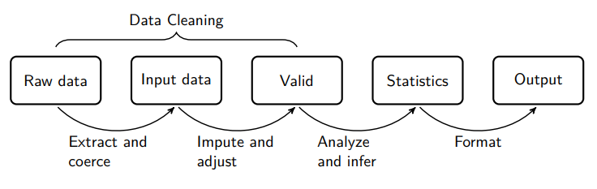
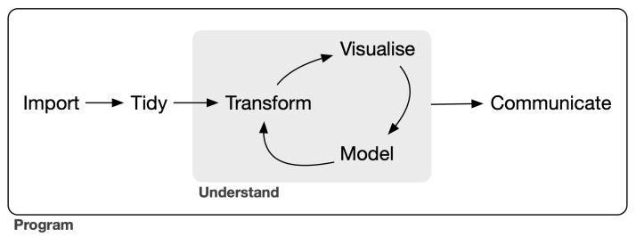

---
output:
  pdf_document:
    keep_tex: yes
    number_sections: yes
    citation_package: natbib  # comentado usa: pandoc-citeproc
    template: latex/templateMemoriaTFE.tex
    pandoc_args: ["--metadata-file=cabecera_capitulos.yaml"]
  html_document: default
#bibliography: bib/library.bib # descomentar si: editor visual RStudio  
editor_options: 
  chunk_output_type: console
---

<!-- escribir 2 para capítulo 3 -->
<!-- \setcounter{chapter}{2} --> 
<!-- \pagenumbering{arabic} -->

`r xfun::file_string('cabecera_capitulos.tex')`

```{r include=FALSE}
source("cabecera_chunk_inicio.R")

```

# Preliminares


<!-- Definir de forma breve y concisa todas las técnicas que serán utilizadas. -->

## Datos georreferenciados

<!-- El objetivo de esta sección es que alguien que puede no estar habituado al manejo de datos espaciales pueda entender, aunque no necesariamente en detalle, las técnicas que se han utilizado hasta poder obtener un data.frame que poder utilizar para realizar todo el análisis. -->

<!-- Usar como modelo la introducción de: https://r.geocompx.org/intro -->


Todos los datos empleados en este trabajo son georreferenciados, lo que significa que están asociados a ubicaciones geográficas específicas. Por ello, resulta esencial introducir los tipos de datos más utilizados para trabajar con esta información, sus características y las herramientas disponibles para manipularlos. En esta sección e tratarán los datos vectoriales y los datos ráster, al ser los tipos fundamentales en este contexto, con características bien diferenciadas entre ellos.


### Datos Vectoriales

El modelo de datos vectoriales se basa en puntos ubicados dentro de un sistema de referencia de coordenadas (CRS, por sus siglas en inglés). Estos puntos pueden representar características independientes o pueden estar conectados para formar geometrías más complejas como líneas y polígonos. Para esta sección se han usado como referencia @lovelace_geocomputation_2019.

#### *Simple Features*{.unlisted .unnumbered}

Las *Simple Features* son un estándar abierto ampliamente utilizado para la representación de datos vectoriales, desarrollado y respaldado por el *Open Geospatial Consortium* (OGC), una organización sin ánimo de lucro dedicada a la creación de estándares abiertos e interoperables a nivel global dentro del marco de los sistemas geográficos de información (GIS, por sus siglas en ingés) y de la *World Wide Web*. [@OCGweb]

El paquete *sf* proporciona en *R* clases para datos vectoriales geográficos y una interfaz de línea de comandos consistente para importantes bibliotecas de bajo nivel para geoprocesamiento (*GDAL*, *PROJ*, *GEOS*, *S2*,...). [@sfpackage]

Los objetos *sf* son fáciles de manipular ya que son *dataframes* o *tibbles* con dos características fundamentales. En primer lugar, contienen metadatos geográficos adicionales: tipo de geometría, dimensión, *Bounding Box* (límites o extensión geográfica)  e información sobre el Sistema de referencia de coordenadas. Y además, presentan una columna de geometrías. Algunas ventajas del uso de este modelo de datos en R son que en la mayoría de operaciones los objeto *sf* se pueden tratar como *dataframes*, los nombres de las funciones son consistentes (todos empiezan por `st_`), las funciones se pueden combinar con el operador tubería y además funcionan bien con el ecosistema de paquetes *tidyverse*.

El paquete *sf* de R soporta 18 tipos de geometrías para las *simple features*, de las cuales las más utilizadas son: *POINT, LINESTRING, POLYGON, MULTIPOINT, MULTILINESTRING, MULTIPOLYGON* y *GEOMETRYCOLLECTION*.


### Datos Ráster

El modelo de datos ráster representa el espacio con una cuadrícula de celdas (o píxeles),y a cada una de las cuales se le asocia un valor o varios, tratándose así de rásteres de una o varias capas, respectivamente. Lo más común es trabajar con cuadrículas regulares, es decir, formadas por celdas rectangulares de igual tamaño. Sin embargo, existen otros modelos de ráster más complejos en los que se usan cuadrículas irregulares (rotadas, truncadas, rectilíneas o curvilíneas). [@lovelace_geocomputation_2019]

Los datos en formato ráster constan de una cabecera y una matriz cuyos elementos representan celdas equiespaciadas. En la cabecera del ráster se definen el sistema de referencia de coordenadas, la extensión (o límites espaciales del área cubierta por el ráster), la resolución y el origen. El origen son las coordenadas de uno de los píxeles del ráster, que sirve de referencia para los demás, siendo generalmente utilizado el de la esquina inferior izquierda ^[Sin embargo, el paquete *TERRA*, usado en este trabajo, usa por defecto el de la esquina superior izquierda [@terrapackage]]. La resolución se calcula como:

$$ resolution = \left(\frac{x_{max}-x_{min}}{ncol},\frac{y_{max}-y_{min}}{nrow}\right) $$

La representación en forma de matriz evita tener que almacenar explícitamente las coordenadas de cada una de las cuatro esquinas de cada píxel, debiendo almacenar solamente las coordenadas de un punto (el origen). Esto hace que el procesamiento de datos ráster sea mucho más eficiente que el de datos vectoriales.

Se usará el paquete *TERRA* para tratar los datos en formato ráster, que permite tratar el modelo de rásteres regulares con una o varias capas a través de la clase de objetos `SpatRaster`. 

<!-- Sin embargo, existen otras alternativas, como el paquete *stars* [@starspackage], que además de ser más potente, permite trabajar con rásteres no regulares y ofrece una mejor integración con el paquete *sf* y el entorno *tidyverse*. -->


### Sistemas de Referencia de Coordenadas

<!-- https://mgimond.github.io/Spatial/chp09_0.html -->
<!-- https://r.geocompx.org/spatial-operations#map-algebra -->

Intrínseco a cualquier modelo de datos espaciales está el concepto de Sistema de Referencia de Coordenadas (CRS), que establece cómo la geometría de los datos se relaciona con la superficie terrestre. Es decir, es el nexo de unión entre el modelo de datos y la realidad, por lo que juega un papel fundamental. Los CRS pueden ser de dos tipos: geográficos o proyectados. En esta sección se usan como referencia el Capítulo 9 de @introGISGimond y el Capítulo 2 de @lovelace_geocomputation_2019.

#### Sistemas de Coordenadas Geográficas {.unlisted .unnumbered}

Los sistemas de coordenadas geográficas (GCS) identifican cada punto de la superficie terrestre utilizando la longitud y la latitud. La longitud es la distancia angular al Meridiano de Greenwich medida en la dirección Este-Oeste. La latitud es la distancia angular al Ecuador medida en la dirección Sur-Norte.

<!-- Podría incluir el dibujo -->

Cualquier sistema de coordenadas geográficas se compone de tres elementos: el elipsoide, el geoide y el *datum*. El primero, el elipsoide o esfera, es utilizado para representar de forma simplificada la superficie terrestre, sobre él se supone que se encuentran los datos y es el que permitirá realizar mediciones. El segundo, el geoide, es el modelo matemático que representa la verdadera forma de la Tierra, que no es suave sino que presenta ondulaciones debidas a las fluctuaciones del campo gravitatorio a lo largo de la superficie terrestre, las cuales también cambian a una amplia escala temporal. Y el tercero, el *datum*, indica cómo se alinean el elipsoide y el geoide, es decir, cómo el modelo matemático se ajusta a la realidad. Este puede ser local o geocéntrico, en función de si el elipsoide se ajusta al geoide en un punto concreto de la superficie terrestre o de si es el centro del elipsoide el que se alinea con el centro de la Tierra. Ejemplos de *datum* geocéntricos usados en este trabajo son:

- *European Terrestrial Reference System 1989* (ETRS89), usado ampliamente en la Europa Occidental.
- *World Geodetic System 1984* (WGS84), usado a nivel global.


#### Sistemas de Coordenadas Proyectadas {.unlisted .unnumbered}

Un Sistema de Coordenadas Proyectadas (PCS) es un sistema de referencia que permite identificar localizaciones terrestres y realizar mediciones en una superficie plana, es decir, en un mapa. Estos sistemas de coordenadas se basan en las coordenadas cartesianas, por lo que tienen un origen, un eje X y un eje Y y usan una unidad lineal de medida (en este trabajo se usará el metro). Pasar de una superficie elíptica (GCR) a una superficie plana (PCS) requiere de transformaciones matemáticas apropiadas y siempre induce deformaciones en los datos.

Al proyectar la superficie terrestre en una superficie plana siempre se modifican algunas propiedades de los objetos, como el área, la dirección, la distancia o la forma. Un PCS solo puede conservar alguna de estas propiedades pero no todas, por lo que es habitual clasificar los PCS en función de la propiedad que mantienen: las proyecciones de igual área preservan el área, las azimutales preservan la dirección, las equidistantes preservan la distancia y las conformales preservan la forma local. En función de como se realice la proyección, estas también se pueden clasificar en planas, cilíndricas o cónicas.

Un caso particular y ampliamente usado de PCS cilíndrico son los *Universe Transverse Mercator* (UTM), en los que se proyecta el elipsoide sobre un cilindro tangente a este por las líneas de longitud (los meridianos). De esta forma, se divide el globo en 60 zonas de 6º de longitud, para cada una de las cuales existe un PCS UTM correspondiente que está asociado al meridiano central. Se trata de proyecciones conformales, por lo que preservan ángulos y formas en pequeñas regiones, pero distorsionan distancias y áreas. 

A lo largo de este trabajo se utilizará el sistema de coordenadas proyectadas UTM30N, ya que es el que traen muchos de los archivos ráster manipulados y es conveniente evitar cambiar de CRS los datos ráster siempre que sea posible, ya que esta operación  provoca una pérdida de información. 


## Análisis Exploratorio de Datos

<!-- https://datos.gob.es/es/documentacion/guia-practica-de-introduccion-al-analisis-exploratorio-de-datos -->
<!-- https://r4ds.hadley.nz/eda#introduction -->

El Análisis Exploratorio de Datos (EDA), es una parte fundamental de todo proyecto de *Machine Learning* y en general de cualquier proyecto en el que se deba trabajar con datos de cualquier procedencia para extraer de ellos conclusiones. Antes del procesamiento de los datos es siempre necesario explorar, entender y evaluar la calidad de estos, pues como indica la expresión inglesa *garbage in, garbage out*, si trabajamos con datos pobres, no podemos esperar obtener de ellos buenos resultados. [@wickham2016r]


El EDA hace referencia al conjunto de técnicas estadísticas (tanto numéricas como gráficas) con las que se pretende explorar, describir y resumir la naturaleza de los datos, comprender las relaciones existentes entre las distintas variables presentes, identificar posibles errores o revelar posibles valores atípicos. Todo esto con el objetivo de maximizar nuestra compresión sobre el conjunto de datos.


### Depuración de los datos
<!-- DEBATE INTERNO SOBRE SI METERLO DENTRO DEL EDA -->
<!-- Citar bien -->

<!-- https://cran.r-project.org/doc/contrib/de_Jonge+van_der_Loo-Introduction_to_data_cleaning_with_R.pdf -->
<!-- https://r4ds.hadley.nz/eda#introduction -->

La depuración de los datos o *data cleaning* es el proceso de detectar y corregir o eliminar datos incorrectos, corruptos, con formato incorrecto, duplicados o incompletos dentro de un conjunto de datos. Puede considerarse una fase dentro del EDA (como se sugiere en @wickham2016r) o una fase previa a este. 

Puede entenderse que el *data cleaning* es el proceso de pasar de *raw data* o datos en bruto a datos  técnicamente correctos y finalmente a datos consistentes. 

<!-- \begin{figure}[!h] -->
<!-- \centering -->
<!-- \includegraphics[width=\textwidth]{graficos/statistical_value_chain.png} -->
<!-- \caption{Cadena de valor estadística. Fuente: } -->
<!-- \label{fig:statistical_value_chain} -->
<!-- \end{figure} -->

```{r, echo = FALSE, fig.cap = "Etapas en el procesamiento de los datos dentro de un proyecto estadístico. \\it Fuente: \\citet{van2018statistical}"}

```

<!-- CUIDADO!! TENGO QUE VER COMO CITARLO BIEN -->

Entendemos que un conjunto de datos es técnicamente correcto cuando cada valor pertenece a una variable y está almacenado en el tipo que que le corresponde en base al conocimiento del dominio del problema. Para ello se debe reajustar el tipo de cada variable al que le corresponda en base al conocimiento que se tenga sobre esta, codificando los valores en las clases adecuadas si fuese necesario.

Decimos que un conjunto de datos es consistente cuando es técnicamente correcto y, además, adecuado para el análisis estadístico. Se trata, por tanto, de datos que han eliminado, corregido o imputado los valores faltantes, los valores especiales, los valores atípicos y los errores.[@de2013introduction]


### Análisis de Componentes Principales

El Análisis de Componentes Principales (PCA) es una técnica de reducción de la dimensionalidad ampliamente usada en el análisis de datos multivariante. Al emplear técnicas de reducción de dimensionalidad como PCA, se persiguen diversos objetivos: eliminar correlaciones redundantes, reducir el ruido presente en los datos y facilitar el uso de algoritmos cuya eficiencia computacional está fuertemente influenciada por la dimensionalidad de los datos. A continuación, se definen los conceptos fundamentales del Análisis de Componentes Principales siguiendo el enfoque expuesto en @PCAShaoDeng.

\begin{definition}
Dadas $\underline x_1, ..., \underline x_n \in \mathbb{R}^k$ realizaciones de un vector aleatorio $\underline X$ en $\mathbb{R}^k$, se dice que los vectores $\underline c_1, \underline c_2,...,\underline c_p \in \mathbb{R}^k$ son las $k$ componentes principales (muestrales) del vector aleatorio $\underline X$ si forman una base ortonormal del espacio $V \subset \mathbb{R}^k$ de dimensión $p$ que minimiza la media del cuadrado de la distancia euclídea entre los $\underline x_i$ y su proyección $\pi_{V}(\underline x_i)$ sobre $V$.
\end{definition}

De la propia definición se desprende que las componentes principales no son únicas.

\begin{proposition}
Las $p$ primeras componentes principales se corresponden con los autovectores unitarios asociados a los $p$ mayores autovalores $\lambda_j$ de la matriz de covarianzas muestrales. 
\end{proposition}

\begin{definition}
Se define la fracción de varianza explicada por las $p$ primeras componentes principales, con $p \le k$, como $\frac{\sum_{j=1}^p \lambda_j}{\sum_{j=1}^k \lambda_j}$.
\end{definition}

El número de componentes principales necesarias para explicar un porcentaje elevado de la varianza de los datos puede servir para caracterizar la complejidad del problema, indicando la verdadera dimensión en la que se encuentran los datos.

<!-- Imputación: Hot Deck Imputation -->

<!-- Escalado y normalización:
+ : Evita que unas variables tengan más peso que otras a la hora de entrenar algunos modelos.
- : Se pierde la interpretabilidad de las variables ya que los datos dejan de estar en las unidades originales- -->

<!-- ## Ingeniería de características -->
<!-- Codificación variables categóricas: Dummy variables -->

<!-- ## Selección de variables -->


## Modelos 
<!-- https://eight2late.wordpress.com/2016/09/20/a-gentle-introduction-to-random-forests-using-r/ -->
<!-- https://eight2late.wordpress.com/?s=decision+tree -->
<!-- https://eight2late.wordpress.com/?s=support+vector+machine -->

El problema que se aborda en este trabajo se engloba dentro de lo que se conoce como aprendizaje supervisado, ya que para cada observación del conjunto de entrenamiento se conoce el valor de la variable objetivo (en este caso si ha habido incendio o no). Más concretamente, se trata de un problema de clasificación binaria, ya que el objetivo es asignar cada observación a una de las dos clases posibles (incendio o no incendio). Existen numerosas técnicas de clasificación binaria supervisada, y en este trabajo se explorarán algunas de las de uso más común en problemas similares. Las principales fuentes consultadas para esta sección han sido @hastie2009elements y el capítulo 6 de @MLmodelSuthaharan. Para entender la intuición detrás de los modelos puede ser útil el blog @eight2late.

### Regresión logística (con penalización)
La regresión logística es un caso particular de modelo lineal generalizado basado en las siguientes hipótesis:

- **Hipótesis distribucional**. Dadas las variables explicativas, $\underline X_i$ con $i = 1,2,...,n$, se verifica que las variables $Y|_{\underline X= \underline x_i}$ son independientes y su distribución pertenece a la familia Bernouilli, es decir,

$$Y|_{\underline X= \underline x_i} \sim Be(\pi( \underline x_i))$$

- **Hipótesis estructural**. La esperanzara $E(Y|_{\underline X = \underline x_i}) = \pi_i$, donde $\pi_i = \pi( \underline x_i)$, está relacionada con un predictor lineal ($\eta_i = \beta^t z_i$) a través de la función *logit* con parámetro $\underline z_i = \left(1,\underline x_i\right)$. Es decir, dado que
$$\eta_i = \underline \beta^t \underline z_i= \ln\left(\frac{\pi_i}{1-\pi_i}\right)$$
O equivalentemente, 
$$\pi_i = \frac{\exp(\underline \beta^t \underline z_i)}{1 + \exp(\underline \beta^t \underline z_i)}$$

Bajo estas hipótesis, la función de log-verosimilitud dada una muestra $\{ (\underline x_i,y_i) \}_{i=1,...,n}$ es: 


$$ l(\underline \beta) = 
\sum_{i=1}^n \left[ 
y_i\ln \left( \frac{\pi_i}{1-\pi_i} \right) + 
\ln \left( 1 - \pi_i\right) \right]$$

<!-- $$ l(\underline \beta) =  -->
<!-- \sum_{i=1}^n \left[  -->
<!-- y_i\ln \left( \frac{\frac{\exp(\underline \beta^t \underline z_i)}{1 + \exp(\underline \beta^t \underline z_i)}}{1-\frac{\exp(\underline \beta^t \underline z_i)}{1 + \exp(\underline \beta^t \underline z_i)}} \right) +  -->
<!-- \ln \left( 1 - \frac{\exp(\underline \beta^t \underline z_i)}{1 + \exp(\underline \beta^t \underline z_i)}\right) \right]$$ -->

En la regresión logística clásica se estima el vector de parámetros $\underline \beta$ maximizando la función de log-verosimilud, o lo que es equivalente, minimizando su opuesta. Por tanto, el problema de optimización a resolver será
$$\min_{\underline \beta} -l(\underline \beta)$$

Sin embargo, con el objetivo de evitar el sobreajuste y construir modelos con mayor capacidad de generalización existen variaciones de la regresión logística que incluyen un término de penalización en la función objetivo. Las dos variantes de uso más extendido son la regresión *ridge* y *lasso*.

Sea $\underline \beta = \left( \beta_0, \underline \beta_1 \right)$, donde $\underline \beta_1$ contiene los coeficientes de las covariables. En la regresión *ridge* el término de penalización es de la forma $\| \underline \beta_1 \|^2_2$ mientras que en la regresión *lasso* es de la forma $\| \underline \beta_1 \|_1$. Por tanto, el problema de optimización será

$$\min_{\underline \beta} -l(\underline \beta)  + \lambda \sum \beta_i^2 $$ 

en el caso de la regresión logística *ridge* y

$$\min_{\underline \beta} -l(\underline \beta)  + \lambda \sum |\beta_i|$$ 

en el caso de la regresión logística *lasso*, donde en ambos casos $\lambda$ es un parámetro de regularización o de penalización.

En este trabajo se usará el paquete *glmnet* [@glmnetpackage], que implementa una combinación de ambos métodos (llamada *elastic net*), en la que se añade un parámetro de mixtura $\alpha \in \left[0,1\right]$ que combina ambos enfoques. El problema de optimización resultante en este caso será:

$$\min_{\underline \beta} -l(\underline \beta)  + \lambda \left[(1-\alpha)\sum \beta_i^2 + \alpha \sum |\beta_i| \right]$$ 

<!-- Lasso: coeficientes no significativos los lleva a 0 -->
<!-- Ridge: reduce los coeficientes que minimizan log-veros. -->
<!-- https://eight2late.wordpress.com/2017/07/11/a-gentle-introduction-to-logistic-regression-and-lasso-regularisation-using-r/ -->


### *Support Vector Machine*

Las Máquinas de Vector Soporte (SVM) son una familia de modelos principalmente usados en problemas de clasificación binaria (si bien se pueden extender a problemas de clasificación multiclase o de regresión) que parten de la idea de encontrar el hiperplano que "mejor" separa al conjunto de puntos.

#### SVM lineal

Dada una muestra $\left\{(\underline x_i,y_i) \right\}_{i=1,...,n}$ con $\underline x_i \in \mathbb{R}^d$ e $y_i \in \{-1,1\}$ para todo $i \in \{1,...,n\}$, el objetivo es encontrar al hiperplano de la forma 

$$h(x) = w_1x_1 +w_2x_2+...+w_dx_d +b = \underline w^t \underline x + b= 0 $$
que mejor separe a la muestra.


<!-- def -->
\begin{definition}
Se dice que la muestra es **linealmente separable** si existe un hiperplano definido por $\underline w^t \underline x + b= 0$, denominado hiperplano de separación, que cumple, para todo $i \in 1,...,n$:
$$\underline w^t \underline x_i + b \ge 0 \; \; \text{si} \;\; y_i=+1$$
$$\underline w^t \underline x_i + b \le 0 \; \; \text{si} \;\; y_i=-1$$
\end{definition}

<!-- Tal vez un dibujo en R2 con un conjunto de puntos lin. separable y varios hiperplanos de separación -->

\begin{definition}
Dado un hiperplano de separación de una muestra linealmente separable, se define el *margen* como la menor de las distancias del hiperplano a cualquier elemento de la muestra. Se denotará por $\tau$.
\end{definition}

\begin{proposition}
Dado un punto $\underline x_i$ y un hiperplano $\pi :\;h(x) = \underline w^t \underline x + b= 0$, la distancia entre ambos viene dada por:
$$d(\pi,\underline x_i) = \frac{|h(\underline x_i)|}{\|w\|} = \frac{y_i(\underline w^t \underline x_i+b)}{\|w\|}$$
donde $\|\cdot\|$ hace referencia a la norma euclídea.
\end{proposition}

<!-- prop -->
\begin{proposition}
Dada una muestra linealmente separable $\left\{(\underline x_i,y_i) \right\}_{i=1,...,n}$ con $\underline x_i \in \mathbb{R}^d$ y $y_i \in \{-1,1\}$ y un hiperplano de separación $h(x) = \underline w^t \underline x = 0$ con margen $\tau$, se verifica que
$$\frac{y_i(\underline w^t \underline x_i+b)}{\|w\|} \ge \tau \;\;\; \forall i\in \{1,...,n\}$$
O equivalentemente,
$$y_i(\underline w^t \underline x_i+b) \ge \tau\|w\| \;\;\; \forall i\in \{1,...,n\}$$
Y, además, es posible reescribir el mismo hiperplano $h$ de forma que $\tau\|w\| = 1$.
\end{proposition}

De está ultima expresión se deduce que maximizar el margen $\tau$ es equivalente a minimizar la norma euclídea de $w$. Por tanto, para encontrar el hiperplano de separación óptimo para una muestra en las condiciones de la proposición anterior basta resolver el problema de optimización siguiente:

\begin{equation}
\begin{aligned}
\min_{w,b} \quad & \frac{1}{2}w^{t}w\\
\textrm{s.a.} \quad & \underline w^t \underline x_i+b \ge 1, \quad & \forall i\in \{1,...,n\} \\
  & w \in \mathbb{R}^d, \space b \in \mathbb{R} \\ 
\end{aligned}
\end{equation}


En general, las muestras no son separables, por lo que es necesario permitir que pueda haber casos mal clasificados, y penalizarlos proporcionalmente a la distancia a la que se encuentren del subespacio correcto (holgura). Para ello, se introducen en la formulación del modelo las variables artificiales $\xi_i,\quad i=1,...,n$. Se habla entonces de hiperplano de separación *soft margin*. De esta forma se llega al problema de optimización siguiente:


\begin{equation}
\begin{aligned}
\min_{w,b,\xi} \quad & \frac{1}{2}w^{t}w+C\sum_{i=1}^{n}{\xi_{i}}\\
\textrm{s.t.} \quad & \underline w^t \underline x_i+b \ge 1, \quad & \forall i\in \{1,...,n\}\\
  &\xi\geq0,   \quad & \forall i\in \{1,...,n\} \\
  & w \in \mathbb{R}^d, \space b \in \mathbb{R} \\
\end{aligned}
\end{equation}

donde $C>0$ es un parámetro de regularización que permite controlar los errores de clasificación permitidos por el modelo, evitando así el sobreajuste. Este parámetro recibe el nombre de coste (*cost*).

<!-- En el modelo final solo influyen los puntos que se encuentren en el soporte (vectores soporte), a diferencia de en la regresión logística, donde se usan todas las observaciones. -->
<!-- En la práctica estos problemas se resuelven a través de su formulación dual. -->

#### SVM no lineal
<!-- https://www.eric-kim.net/eric-kim-net/posts/1/kernel_trick.html -->

Existen muchos casos en los que el SVM no es capaz de obtener buenos resultados, debido a la estructura de la distribución de las clases en la muestra. En estos casos, es común recurrir a una técnica llamada *kernel trick*. Esta herramienta consiste en realizar una inmersión del conjunto de los vectores de la muestra en un espacio de dimensión superior (llamado *feature space*) en el que los casos sí sean separables (o al menos mejore la separabilidad de estos). Esta inmersión en un espacio de dimensión superior se hace indirectamente a través de funciones *kernel*, que calculan los productos escalares entre los vectores de la muestra en el espacio de inmersión.
Existen distintos tipos de funciones *kernel* que se corresponden con distintas inmersiones en espacios de dimensión superior:

- Kernel polinomial: $k(x,z) = \left( \gamma(x^tz + c_0) \right)^p$
- Kernel RDF (Radial Basis Function), radial o gaussiano: $k(x,z) = \exp(-\gamma \| x-z\|^2)$ 


### Árboles de decisión
<!-- Elements of Statistical Learning, pag 324 -->

Un árbol de decisión (DT) es un algoritmo de aprendizaje supervisado no paramétrico, que puede aplicarse tanto a problemas de clasificación como de regresión. La idea de este método es segmentar el espacio predictor mediante hiperplanos ortogonales a los ejes, de forma que para predecir una observación se usa la moda o la media de la región a la que pertenece. Se trata de un modelo jerárquico con estructura de árbol, que consta de un nodo raíz, ramas, nodos internos y nodos hojas. Cada nodo representa un test sobre una variable, y cada las ramas que nacen de ese nodo representan los posibles valores que puede tomar esa variable. De esta forma, para clasificar una nueva instancia basta comenzar en el nodo raíz e ir descendiendo por el árbol hasta llegar al nodo hoja correspondiente, que indicará la clasificación asignada a dicha instancia. La simplicidad del método muestra su principal ventaja, su fácil comprensión dada su estructura de árbol. 


Existen diversas técnicas para construir árboles de clasificación (y regresión), aquí se ilustra una de las más usadas que recibe el nombre de CART (*Clasification And Regression Trees*, @breiman1984classification). Se explica para el caso de árboles de clasificación binarios, es decir,  en los que de cada nodo salen dos ramas.

Dada una muestra $\left\{ (\underline x_i,y_i) \right\}$ con $\underline x_i = (x_{i1},...,x_{id})$, un árbol de clasificación con $J$ hojas se puede expresar como
$$f(\underline x) = \sum_{j=1}^J c_j I(\underline x \in R_j)$$
donde $\left\{ R_j\right\}_{j=1,...,J}$ es una partición del espacio predictivo y $c_j$ es la clase asignada en $R_j$ para todo $j \in {1,...,J}$.

En la práctica, $c_j$ se estima asignando la clase mayoritaria en el recinto $R_j$. Es decir, $\hat c_j = moda(\{y_i | \underline x_i \in R_j\})$.
<!-- Y c_j es una de las dos clases posibles -->


Para construir un árbol de clasificación, el algoritmo necesita decidir las variables tests y los puntos de corte en cada nodo, así como la topología del árbol. Para realizar esto, se vale de un algoritmo *greedy*, que en cada nodo elige la variable y el punto de corte que mejor separan los datos en base a una medida de impureza. Es decir, la construcción de un árbol de clasificación no se hace mediante la resolución de un solo problema de optimización global, si no a partir de la resolución de muchos problemas de optimización locales, con las implicaciones que esto pueda tener.

<!-- Poner como definición: función de impureza -->
Las medidas de impureza más comúnmente usadas son:

- Error de clasificación: $\Phi(p) = 1 - \max(p,1-p)$

- Índice de Gini: $\Phi(p) = 2p(1-p)$

- Entropía: $\Phi(p) = -p \log p - (1 - p) \log (1 - p)$

donde $p$ denota la proporción de casos positivos en la muestra.
<!-- disyunción de conjunciones de restricciones sobre las covariables. -->

Así, el algoritmo de construcción de un árbol de clasificación es:

1. Comenzar con el nodo raíz, que incluye todos los casos.

2. Determinar el par (variable,corte) que conduce a una mayor reducción de la impureza. Es decir, dada una medida de impureza $\Phi$ se busca la variable $j \in {1,..,d}$ y el corte $s \in \mathbb{R}$ solución de
$$\min_{j \in {1,..,d},\;s \in \mathbb{R}}\left[ 
\frac{|R_1|}{|R_1|+|R_2|} \Phi \left(\{y_i |\underline x_i \in R_1(j,s)\} \right)  + 
\frac{|R_2|}{|R_1|+|R_2|} \Phi \left(\{y_i |\underline x_i \in R_2(j,s)\} \right)\right]$$
donde $R_1(j,s) = \{X | X_j \le s \}$ y $R_2(j,s) = \{X | X_j > s \}$.

3. Aplicar iterativamente el proceso anterior a cada nuevo nodo, hasta que se verifiquen las condiciones de finalización. En este caso, el criterio será finalizar el proceso de división en el nodo una vez que el número de casos en este sea igual o inferior a una cantidad $n_{min}$ fijada de antemano. En los nodos hoja se asigna la clase mayoritaria en el nodo.

4. Podar o recortar el árbol obtenido en base a un criterio de coste-complejidad. Dado un árbol completo $T$ y un valor del parámetro de coste-complejidad $\alpha$, se elije el subárbol $T_0 \subset T$ obtenido a partir de $T$ mediante poda, es decir, colapsando nodos no terminales, que minimice el criterio de coste complejidad definido como:

$$C_{\alpha}(T) = \Phi(T) + \alpha|T_0|$$
El parámetro $\alpha$ permite controlar la capacidad de generalización del modelo (*Bias-Variance Tradeoff*) y se estima mediante Validación Cruzada.


El gran inconveniente de los árboles de decisión es que en general son modelos con una varianza elevada, por lo que tienden a ser inestables y a producir sobreajuste. Para evitar esto, se recurre al uso de técnicas de *Bagging* y *Boosting*. Una de las técnicas más extendida con árboles de decisión son los Bosques Aleatorios (*Random Forest* en inglés).
<!-- Inconveniente: Modelo muy sesible a pequeños cambios en los datos (inestable) -> Modelo con mucha varianza -> Overfitting!! -->
<!-- Solución: Random Forest -->

### *Random Forest*

<!-- Elements of Statistical Learning, pag 601 -->
La idea detrás del modelo de bosques aleatorios es reducir la varianza de los árboles de decisión sin aumentar el sesgo. Para intentar conseguir este objetivo, la idea es aplicar *Bagging* (*Bootstrap Aggregating*) al modelo de árbol de decisión. Sin embargo, ya que al aplicar *Bagging* la redución de la varianza es mayor cuanto más incorrelados sean los predictores individuales, en cada nuevo nodo de cada árbol construido se selecciona la variable que más disminuya la impureza de entre un conjunto aleatorio  de $m_{try} < d$ predictores.

<!-- Ponerlo guay como algoritmo (estilo proposición,...): -->
El algoritmo para construir un bosque aletorio es el siguiente:

1. Para $b = {1,...,B}:$

    a) Seleccionar una muestra bootstrap $Z^*$ de tamaño $n$ del conjunto de entrenamiento.
    b) Construir un árbol de decisión $T_b$ a partir de la muestra bootstrap $b$, aplicando recursivamente los siguiente pasos para cada nodo terminan del árbol, hasta que se alcanze el tamaño mínimo de nodo $n_{min}:$
          
          i. Seleccionar aleatoriamente $m_{try}$ variables de entre las $d$ variables predictoras.
          ii. Elegir el mejor par variable/división de entre las $m\_try$ variables seleccionadas en función de la reducción del criterio de impureza.
          iii. Dividir el nodo en dos nodos hijos.

2. De esta forma se obtiene el conjunto de árboles de decisión bootstrap $\left\{ T_b \right\}_{b=1}^B$.

Para predecir la clase de un nuevo punto $\underline x$ se aplica la regla de la clase más votada al conjunto de clases predichas por los $B$ árboles de decisión bootstrap para $\underline x$.


<!-- Sea $\hat C_b(\underline x)$ la clase predicha por el b-ésimo árbol de decisión bootstrap. Entonces, $\hat C_{rf}^B(\underline x) = majority\space  vote \space \{\hat C_b(\underline x)\}$. Es decir, se asigna la clase más votada. -->

<!-- Citar bien a Elements of Statistical Learning -->


<!-- ### Redes Neuronales -->

### K-*Nearest Neighbours*
El método de k vecinos más cercanos (KNN) clasifica una nueva observación  $\underline x$ en base a las clases de las $k$ observaciones del conjunto de entrenamiento más cercanas a estas en el espacio muestral aplicando la regla de la clase más votada. Es decir, dado un espacio muestral $\Theta$ con una distancia $d$ definida sobre él, dado un conjunto de entrenamiento $T \subset Y$ y dado $k \in \mathbb{N^+}$, la función calculada por el algoritmo para estimar la clase de $\underline x \in \Theta$ es:

$$f(\underline x) = mayority\; vote\;\{ y_i \,| \, \underline x_i \in N_k(\underline x)\}$$
donde $N_k(\underline x)$ es el conjunto de los $k$ puntos $\underline x_i \in \Theta$ más próximos a $\underline x$ en $\Theta$ en base a la distancia $d$.

El parámetro *k* permite controlar el sobreajuste del modelo.


## Validación del ajuste
Para validar el ajuste de los modelos comentados en los datos, se utilizará una partición temporal en entrenamiento-validación-test. Es decir, se asignará el primer 60% de los datos (de acuerdo al día de la observación) a entrenamiento, el 20% siguiente a validación y el último 20% a test. Este enfoque permite evitar el sesgo positivo debido al efecto *look-ahead* en la estimación de la capacidad de generalización de los modelos.

## Evaluación de los modelos

Una vez construido un modelo predictivo es necesario conocer el rendimiento de este sobre nuevos datos, con el objetivo de estimar su capacidad de generalización. Esto es fundamental de cara a determinar si el modelo es adecuado para el propósito previsto o si necesita ajustes o mejoras. La evaluación del rendimiento permite comparar entre diferentes modelos y seleccionar el que mejor se adapte a las necesidades específicas del problema en cuestión. Para ello, se recurre al uso de distintas métricas, en función de las características propias de cada problema.


### Clasificación binaria
En el presente trabajo el problema que se aborda es un problema de clasificación binaria, pues tenemos solo dos clases que son la clase positiva y la clase negativa. A la hora de clasificar una nueva instancia pueden darse 4 situaciones:
<!-- Puedo añadir un dibujito -->

- Que se clasifique como positiva siendo realmente positiva, en cuyo caso se dirá que forma parte de las *True Positives (TP)*

- Que se clasifique como negativa siendo realmente negativa, en cuyo caso se dirá que forma parte de las *True Negatives (TN)*

- Que se clasifique como positiva siendo realmente negativa, en cuyo caso se dirá que forma parte de las *False Positives (FP)*

- Que se clasifique como negativa siendo realmente positiva, en cuyo caso se dirá que forma parte de las *False Negatives (FN)*

Se considerarán las siguientes métricas de rendimiento para problemas de clasificación binaria:

<!-- Hay que ver cómo poner ahí la definición bien: bookdown -->

**Tasa de acierto o exactitud**.
Mide la proporción de casos que han sido correctamente clasificados.
$$Exactitud = \frac{TP + TN}{TP + FP + TN + FN}$$


**Precisión**.
Mide la proporción de casos clasificados como positivos que realmente lo son.
$$ Precisión = \frac{TP}{TP + FP}$$

**Especificidad**.
Mide la proporción de casos negativos que han sido correctamente clasificados por el modelo.
$$ Especificidad = \frac{TN}{TN + FP}$$

**Sensibilidad o recall**.
Mide la proporción de casos positivos que han sido correctamente clasificados por el modelo.
$$ Recall = \frac{TP}{TP + FN}$$


**AUC-ROC**.
Mide el área bajo la curva ROC (*Receiver Operating Characteristic* o Característica Operativa del Receptor en castellano). Esta curva es una representación gráfica del rendimiento de un modelo de clasificación binaria para todos los umbrales de clasificación. Representa la sensibilidad frente a la proporción de falsos positivos para cada posible umbral de clasificación. El AUC está comprendido entre 0 y 1, entendiéndose que el rendimiento del es mejor cuanto mayor sea su valor. En general, se suelen considerar aceptables modelos con un valor del AUC superior a 0.75. Obsérvese por ejemplo la Figura \ref{fig:roc_validation}.


## Herramientas

<!-- https://www.r-project.org/ -->
Toda la parte práctica del presente trabajo se ha llevado a cabo empleado el lenguaje de programación R [@Rproject] a través del entorno de desarrollo integrado que ofrece RStudio. R es un lenguaje y entorno de programación de código abierto desarrollado dentro del proyecto GNU y orientado a la computación estadística. Este lenguaje puede extender sus funcionalidades fácilmente a través de la gran cantidad de paquetes disponibles dentro del repositorio de paquetes de CRAN (*The Comprehensive R Archive Network*), siendo este uno de sus puntos fuertes, dada la gran comunidad de usuarios y desarrolladores con la que cuenta. A continuación se mencionan los principales paquetes utilizados en el trabajo.

A lo largo de todo el trabajo, se ha utilizado de forma central el ecosistema de paquetes *tidyverse* [@tidyversepackage]. Se trata de una colección de paquetes de R que comparten las mismas estructuras de datos y la misma filosofía de programación, orientados a facilitar las tareas centrales de cualquier proyecto de *data science* (Figura \ref{fig:tidiverse_workflow}). Cuenta con numerosos paquetes, entre los que destacan: *readr* para la importación de datos tabulares; *tidyr* para la ordenación; *dplyr* para la manipulación; *lubridate* para las fechas; *forcats* para los factores; *ggplot2* para la visualización; *purr* para la programación funcional; y *tibble* que proporciona la estructura tabular de datos sobre la que trabajar. 

```{r tidiverse_workflow, echo = FALSE, fig.cap = "Flujo de trabajo en un proyecto de \\textit{data science}. \\it Fuente: \\citet{tidyversepackage}"}

```


Para la modelización se ha utilizado *tidymodels* [@tidymodelspackage]. Se trata de un conjunto de paquetes de R orientados a facilitar el flujo de trabajo en el modelado estadístico de datos, siguiendo la filosofía "tidy data" de *tidyverse*. Integra herramientas para preprocesamiento de datos (*recipes*), ajuste de modelos (*parsnip*), combinación de flujos de trabajo (*workflows*), partición de datos y validación cruzada (*rsample*), cálculo de métricas de rendimiento (*yardstick*), optimización de hiperparámetros (*tune*) y conversión de resultados de modelos a formatos ordenados (*broom*). Los paquetes que componen *tidymodels* no implementan los modelos estadísticos por sí mismos, si no que los importan de librerías específicas. En su lugar, se enfocan en facilitar el flujo de trabajo del modelado, mejorando la cohesión y la eficiencia, y permitiendo la integración natural con otros paquetes del *tidiverse*.

Como se detalló en la Sección [Datos georreferenciados], para el tratamiento de datos vectoriales se ha utilizado el paquete de R *sf* [@sfpackage], que proporciona una forma estandarizada de codificar y manipular datos espaciales vectoriales a través de las *simple features*, integrándose dentro del ecosistema *tidyverse*. Para la manipulación de datos de tipo ráster se ha recurrido al paquete *terra* [@terrapackage]. 

La descarga de información meteorológica satelital se ha realizado a través del paquete *nasapower* [@nasapower], que facilita el acceso a información meteorológica global de forma reproducible a través de R. El paquete *mapSpain*[@R-mapspain] ha facilitado el acceso a las fronteras administrativas de España a distintos niveles de desagregación (comunidad autónoma, provincia y municipio). Se basa en el *GISCO Eurostat database* (\url{https://ec.europa.eu/eurostat/web/gisco}) y en el *CartoBase SIANE* del Instituto Geográfico Nacional (\url{https://www.ign.es/}).


<!-- library(tidyverse) -->
<!-- library(skimr) -->
<!-- library(sf) -->
<!-- library(corrplot) -->
<!-- library(GGally) # Coordenadas paralelas -->
<!-- library(ggpubr) -->
<!-- library(tidyverse) # Manipulación de datos  -->
<!-- library(sf) # Vector data -->
<!-- library(terra) # Raster data -->
<!-- library(mapSpain) # Polígonos de regiones de España -->
<!-- library(magrittr) # Operador %<>%  -->
<!-- library(tidymodels) -->
<!-- library(sf) -->
<!-- library(ggplot2) -->
<!-- library(akima) # interp -->
<!-- library(magrittr) -->
<!-- library(ggpubr) -->
<!-- library(forcats) -->
